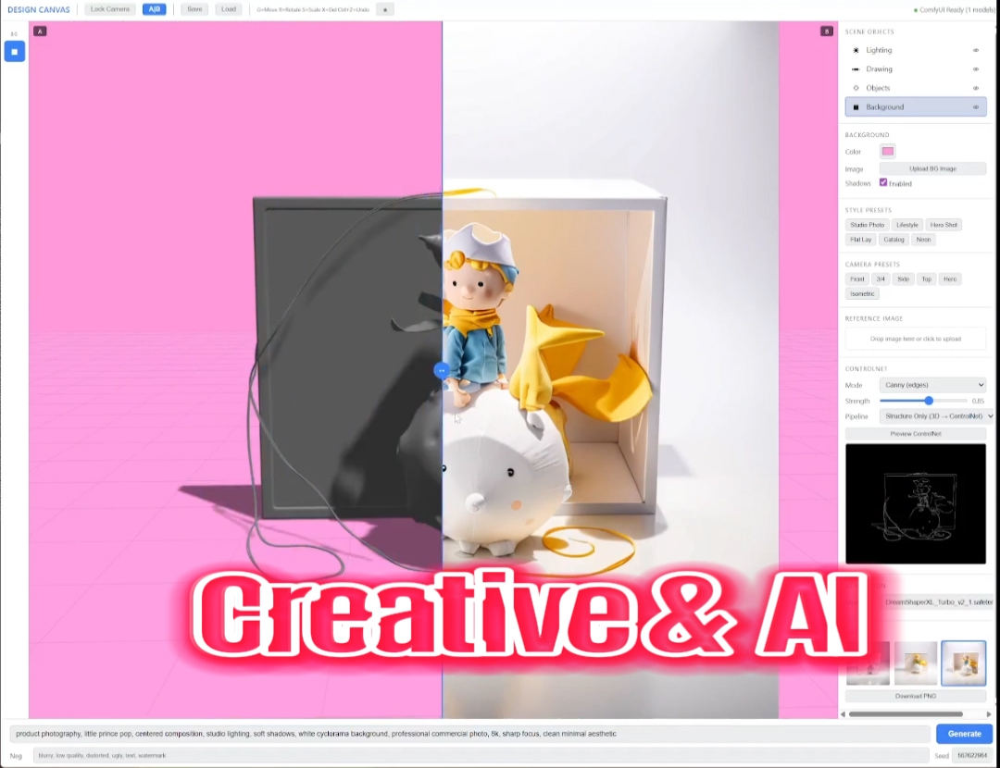
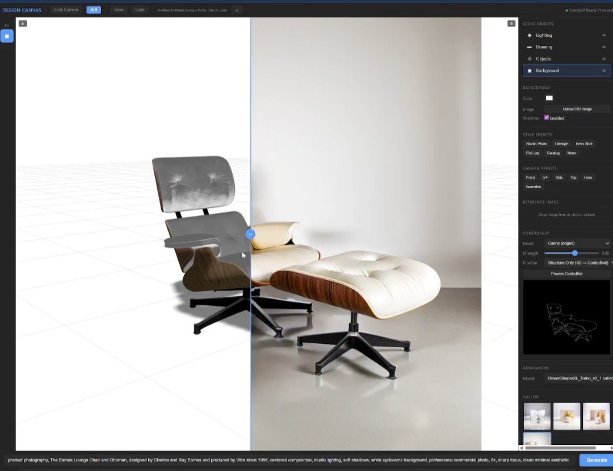
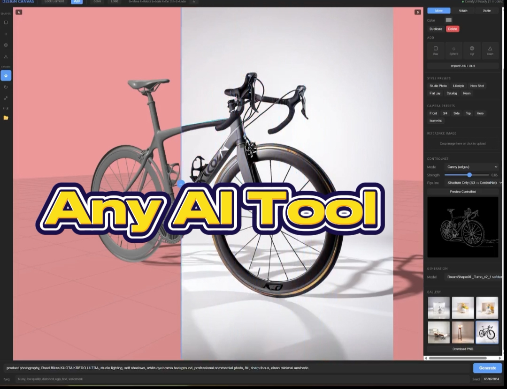
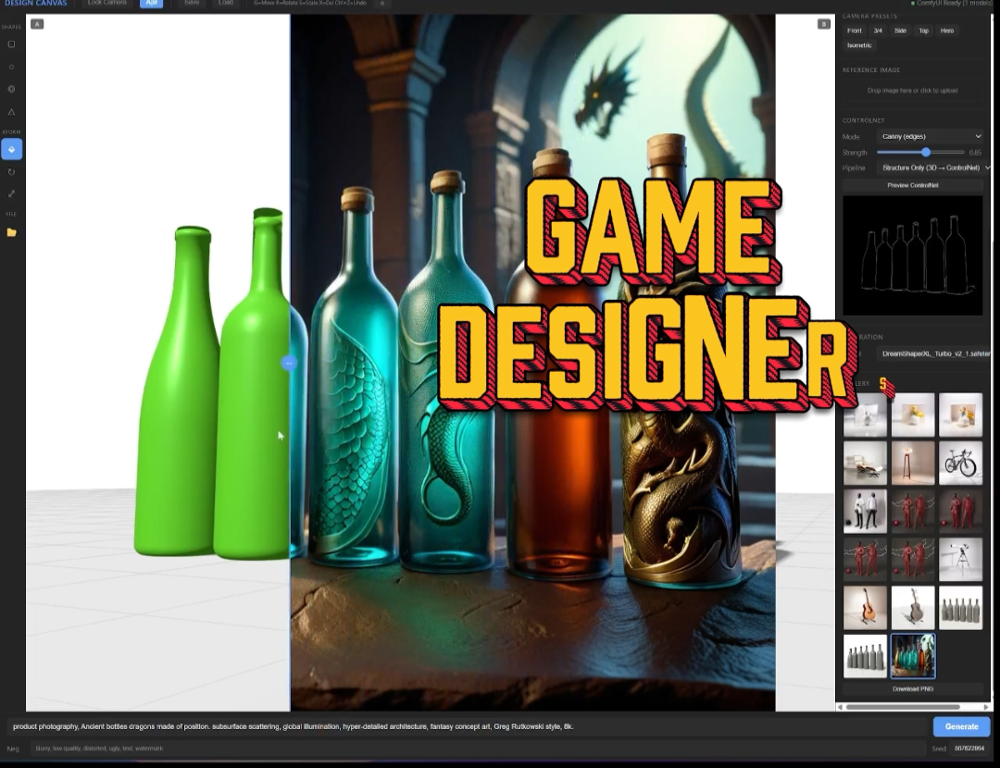
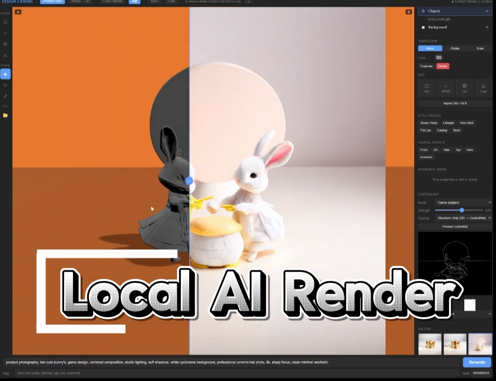

# Design Canvas 🎨
> **3D Staging Canvas → AI Product Renders, powered by ComfyUI**

<p align="center">
  
</p>

[](https://www.python.org/)
[](https://fastapi.tiangolo.com/)
[](https://threejs.org/)
[](https://github.com/comfyanonymous/ComfyUI)
[](https://huggingface.co/stabilityai/stable-diffusion-xl-base-1.0)

---

### 🖥️ Performance Environment


---

## ✨ Overview

**Design Canvas** turns a lightweight 3D staging scene into a finished, photorealistic
product render. Place primitives or imported `OBJ`/`GLB` models on a canvas, sketch the
details you want, write a prompt — and the composite is handed off to **ComfyUI** for
SDXL generation.

The server itself is a thin **FastAPI** bridge: it owns **zero VRAM**. ComfyUI is
auto-launched as a subprocess and manages all GPU work independently, so the app stays
responsive while the GPU is fully committed to diffusion.

> **The idea:** block out a scene like a 3D artist, then let diffusion do the lighting,
> materials, and finish like a studio photographer.

---

## 🚀 Key Features

| | |
|---|---|
| 🧱 **3D Staging** | Box / sphere / cylinder / cone primitives, plus `OBJ` (+MTL) and `GLB` (+textures) import via drag-and-drop. |
| ✏️ **Drawing Layer** | Pencil, eraser, line, arrow and text tools to annotate intent directly on the canvas. Undo/redo (`Ctrl+Z` / `Ctrl+Y`). |
| 💡 **Lighting Rig** | Direction, intensity, height, angle, color and ambient controls — staged before generation. |
| 🎥 **Camera Presets** | Front, 3/4, Side, Top, Hero and Isometric views with animated transitions. |
| 🖼️ **Style Presets** | Studio Photo, Lifestyle, Hero Shot, Flat Lay, Catalog and Neon looks. |
| ⚙️ **Workflow Swapping** | Ships with an SDXL img2img workflow; upload any custom ComfyUI workflow JSON. |
| 📊 **Live Progress** | Real-time WebSocket progress bar streamed straight from ComfyUI. |
| 🆚 **A\|B Compare** | Before/after comparison slider and a gallery lightbox for every result. |
| 🎯 **Reproducible** | Seed control, negative prompt field and checkpoint selector (auto-detected). |

---

## 🧩 How It Works

```text
 ┌─────────────┐   composite PNG    ┌──────────────┐   API workflow   ┌───────────┐
 │  3D Canvas  │  ───────────────▶  │   FastAPI    │  ──────────────▶ │  ComfyUI  │
 │ (Three.js)  │   base64 over      │   bridge     │   /prompt        │   (SDXL)  │
 │  + Drawing  │   HTTP             │  (0 GB VRAM) │ ◀────────────────│   GPU     │
 └─────────────┘                    └──────────────┘   result image   └───────────┘
        ▲                                  │  WebSocket progress             │
        └──────────────────────────────────┴─────────────────────────────────┘
```

1. **Stage** — place 3D objects and set the lighting/camera.
2. **Sketch** — switch to the Drawing layer and annotate what to add.
3. **Prompt** — describe the desired effect and style.
4. **Generate** — the canvas composite is sent to ComfyUI for img2img diffusion.
5. **Compare** — review in the gallery, A\|B against the source, download as PNG.

**Workflow placeholders** injected at runtime: `CANVAS_IMAGE`, `POSITIVE_PROMPT`,
`NEGATIVE_PROMPT`, `CHECKPOINT_NAME`.

---

## 📸 Screenshots

| | |
|---|---|
|  |  |
| **A\|B preview — staged 3D vs. finished AI render** | **Product Shot — Eames lounge, studio finish** |
|  |  |
| **ControlNet Canny — structure-locked render** | **Concept art — fantasy bottle set** |



**Local AI render — fully on-device, zero cloud**

---

## ⚡ Quick Start

**Requirements:** Python 3.10+, a working [ComfyUI](https://github.com/comfyanonymous/ComfyUI)
install, and an SDXL checkpoint (RealVisXL, Juggernaut XL or DreamShaper XL recommended).

```bash
# 1. Clone
git clone https://github.com/Pro2004-a11/design_canvas.git
cd design_canvas

# 2. Create the environment
python -m venv .venv
# Windows
.venv\Scripts\activate
# Linux / macOS
source .venv/bin/activate

# 3. Install dependencies (no torch/diffusers — ComfyUI owns the GPU)
pip install -r requirements.txt

# 4. Run
python server.py
```

Open **http://127.0.0.1:5000** in your browser.

### On the ComfyUI side

Design Canvas does **not** ship a model — it only drives a ComfyUI instance.
Before running the server, make sure ComfyUI is set up:

1. **Install ComfyUI** — see the [official guide](https://github.com/comfyanonymous/ComfyUI#installing).
2. **Add an SDXL checkpoint** — drop a `.safetensors` file into
   `ComfyUI/models/checkpoints/`. RealVisXL, Juggernaut XL or DreamShaper XL
   give the best product-render results. The server auto-detects it.
3. **(Optional) ControlNet** — for the structure-locked Canny mode, install an
   SDXL ControlNet model into `ComfyUI/models/controlnet/`.
4. **Port** — ComfyUI must be reachable on `127.0.0.1:8188` (its default).

The server **auto-launches** ComfyUI for you. Point it at your install:

```bash
# Windows
set COMFYUI_DIR=C:\path\to\ComfyUI

# Linux / macOS
export COMFYUI_DIR=/path/to/ComfyUI
```

> Prefer to manage it yourself? Just start ComfyUI manually on port `8188`
> before launching `server.py` — the server will detect and reuse it.

Or start ComfyUI manually on port `8188` before launching the server.

---

## 📂 Project Structure

```text
/design_canvas
├── server.py            # FastAPI ↔ ComfyUI bridge (0 GB VRAM)
├── app.html             # Single-page 3D canvas UI (Three.js r162)
├── requirements.txt     # Python dependencies
├── workflows/           # ComfyUI workflow JSONs (swappable at runtime)
├── _templates/          # Example workflow templates
├── uploads/             # Imported OBJ/GLB models (git-ignored)
└── docs/
    ├── make_placeholders.py   # Screenshot placeholder generator
    └── screenshots/           # README imagery
```

---

## 🛠️ Tech Stack

| Layer | Technology |
|---|---|
| **Frontend** | HTML5 Canvas, Three.js `r162`, `OBJLoader` / `GLTFLoader` |
| **Backend** | Python 3.10+, FastAPI, Uvicorn, aiohttp |
| **Generation** | ComfyUI, Stable Diffusion XL (img2img, DPM++ 2M Karras) |
| **Transport** | HTTP + WebSocket (live progress) |

---

## 🗺️ Roadmap

- [ ] IP-Adapter for true reference-image style transfer
- [ ] Post-composite product protection (mask-based blending)
- [ ] Batch generation — multiple seeds per request
- [ ] Environment maps / HDRI lighting

---

## 📄 License

Released under the [MIT License](LICENSE).

---

<sub>Built by Yosi Refaeli · Senior Technical Artist & AI Systems</sub>
